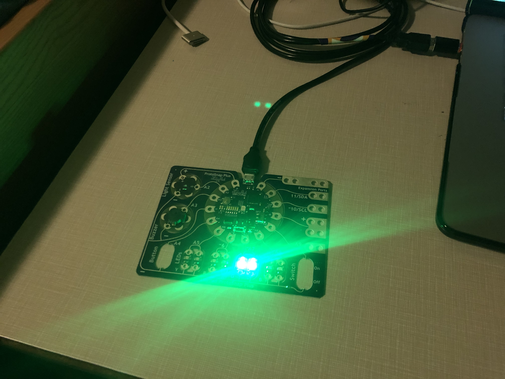

## The Code

Welcome back to Snek Nessssst! For this assignment, we used code to mimic circuits. We used two boolean variables: "btn" and "swt," to mimic a button and switch respectively. And for all four combinations of the variables' enabled/disabled status, a different light turns on.

We had the choice of using logical operators or nested conditionals to sort between our light outputs, and for this project, I went with logical operators. Though for the record, I did try the assignment with nested conditionals, and I didn't like it as much. Operators allow me to create a cleaner, more compact piece of code that I find easier to navigate. Everything is so organized when each conditional line only has one output.

## The Light

Now behold! The pretty green light that turns on when the switch is enabled and the button is disabled.

What? I didn't need an image? Dang it, Ursa!

A tip I would give my past self would be to keep the code simple. That's where I went wrong with the last assignment. If something repetitive can be rewritten with fewer lines of code, it'll be much easier to navigate and check for mistakes that way.
