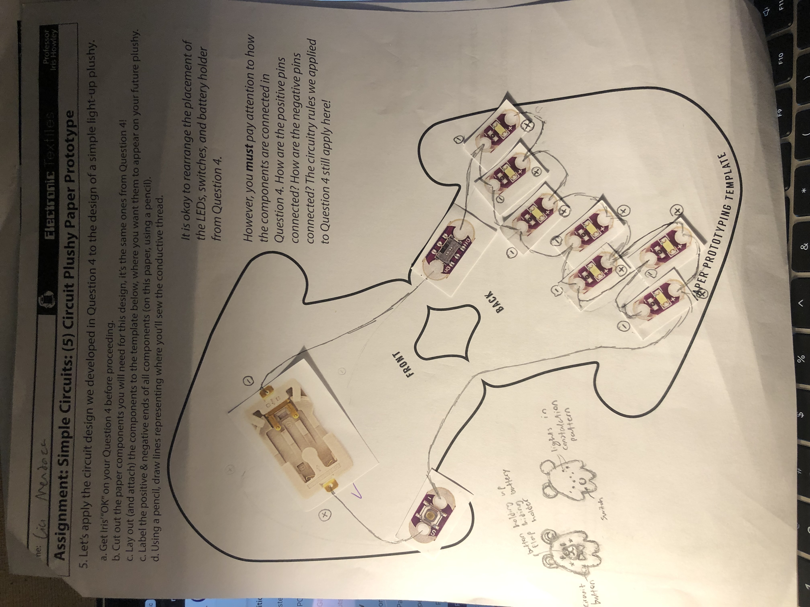

I wish I was joking when I told my associate this would take over 10 hours. But who said snakes are liars!
## As I contemplate my life choices, allow me to introduce my latest abomination: Minor!

Minor is inspired by my very own unpaid worker, Ursa. With this new plush, I now have two minions to aid me in my evilness.

Minor was originally supposed to be a bear, but they ended up being more of a bear/mouse hybrid. They have a button on their right hand and switch on their left leg that connect to seven lights along their back. And the battery holder is hidden under the white fabric representing their snout, held in place by a home-made black button nose! The conductive thread connecting each electrical component is woven into the fabric as a hidden stitch, a running stitch with small spaces on top so that it's nearly invisible. 
When the button and switch are activated simultaneously, the back of the plushy lights up in a *particular* constellation pattern.

One of the most difficult parts of this project was making sure the circuit was connected correctly. The positive and negative ends of the lights needed to be connected to the right ends of the battery, and I had to work carefully to make sure that the conductive thread never crossed and caused a short circuit. Since I was using seven lights so close together, I purposefully gave the wiring plenty of space with the hidden stitch and kept the ends of the thread very short. The paper prototype helped me plan out where to place everything.

As for the other details: the edges of the plush are sealed with a whip stitch, the eyes and inside of the bowtie were made using a satin stitch, the shape of the mouth was formed with a back stitch, and the other components like the snout fabric and ears pieces were connected with running stitches. And the button is made of good ol' cardboard and black duct tape that I stabbed holes into. Also, the whole thing is stuffed with crumpled paper towels, courtesy of the local bathroom.

My tip to future undertakers of this project is to make good use of needle threaders, not for threading needles (I never used them for that), but for tying finishing knots! Often, I would come to the end of my fabric and lack enough space to get my needle through a loop. Fortunately, with enough finessing, needle threaders can tie that knot! They're also good for tying knots in hard-to-reach places, like the inside of a whip stitch.
