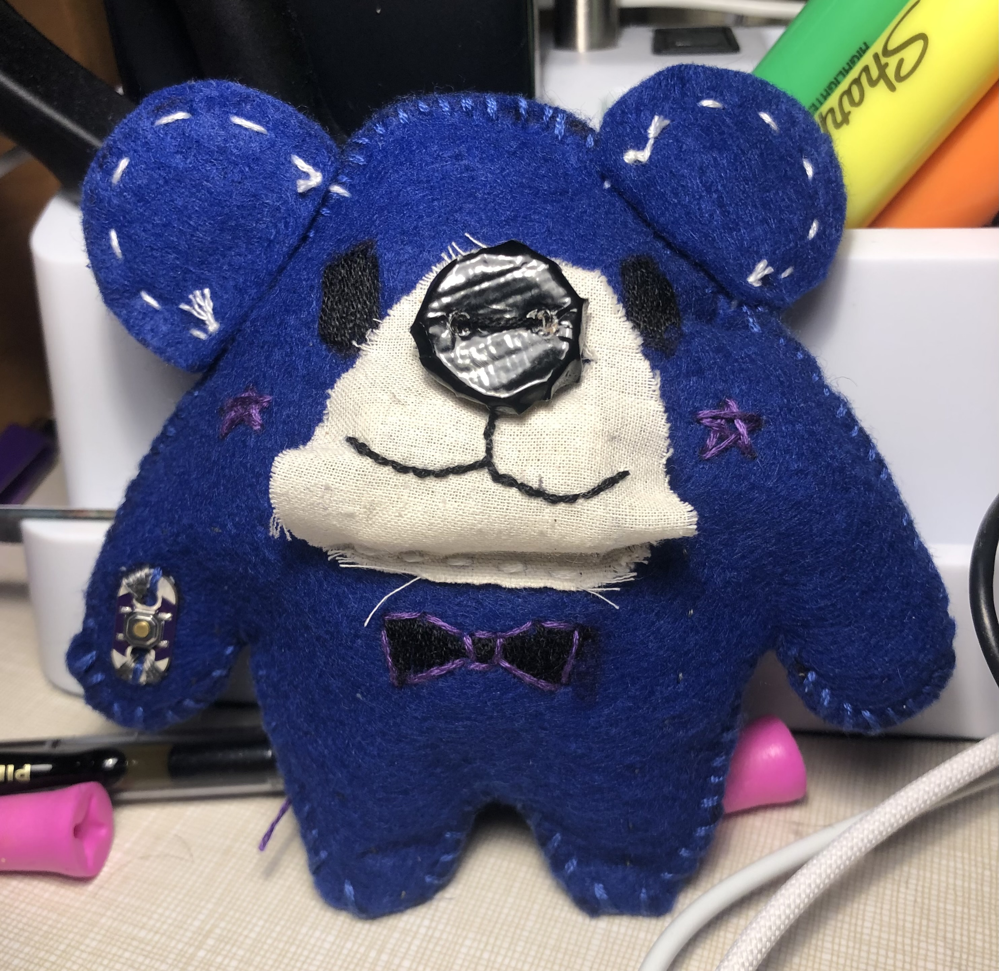
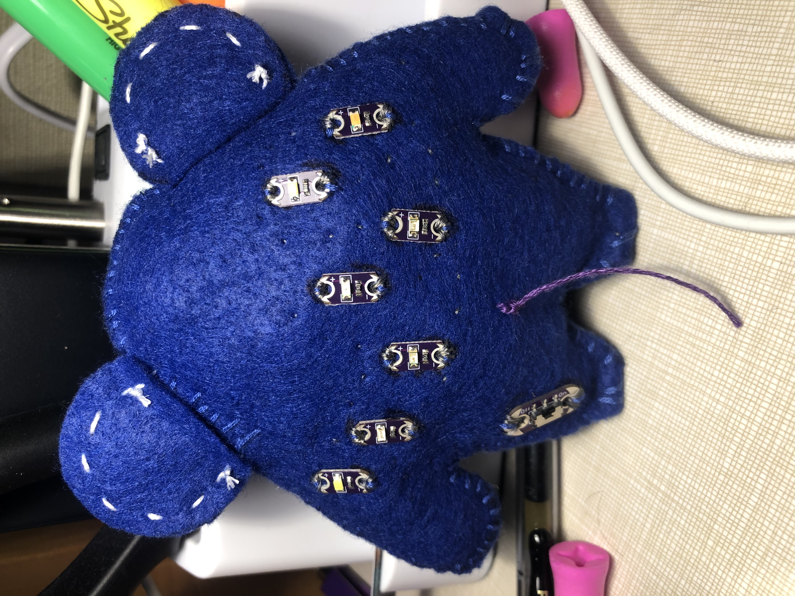
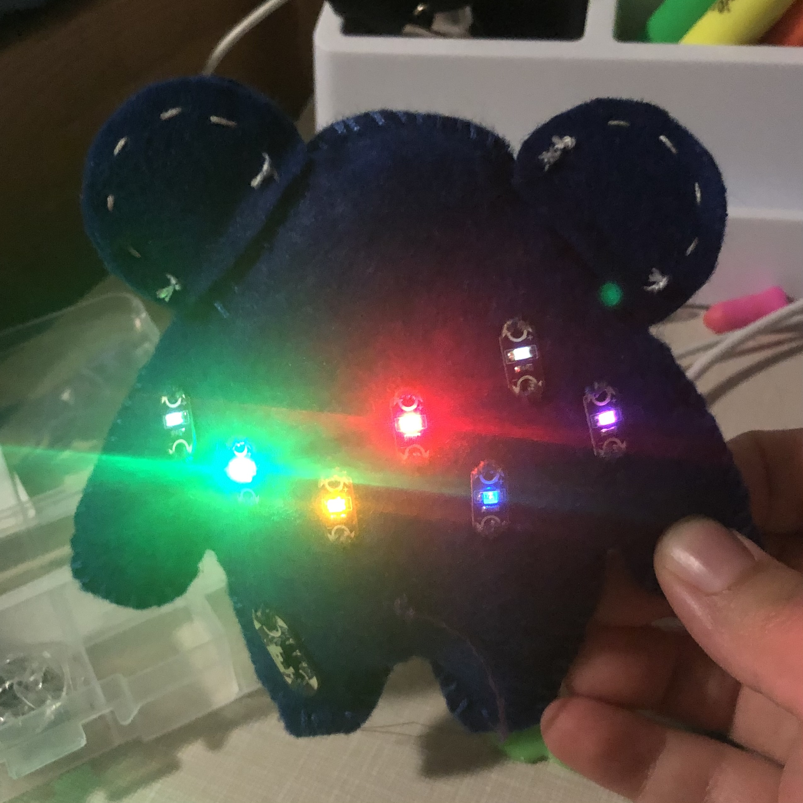

I wish I was joking when I told my associate this would take over 10 hours. But who said snakes are liars!
## As I contemplate my life choices, allow me to introduce you to my latest abomination: Minor!

Minor is inspired by my very own unpaid worker, Ursa. With this new plush, I now have two minions to aid me in my evilness.

Minor was originally supposed to be a bear, but they ended up being more of a bear/mouse hybrid. They have a button on their right hand and switch on their left leg that connect to seven lights along their back. And the battery holder is hidden under the white fabric representing their snout, held in place by a home-made black button nose! The conductive thread connecting each electrical component is woven into the fabric as a hidden stitch, a running stitch with small spaces on top so that it's nearly invisible. 
When the button and switch are activated simultaneously, the back of the plushy lights up in a *particular* constellation pattern.

