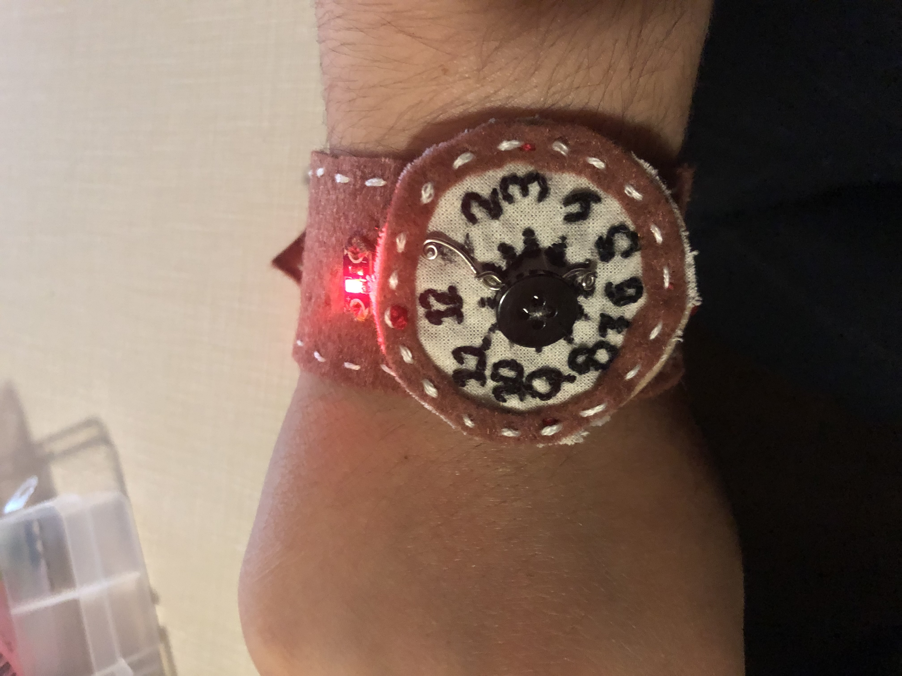
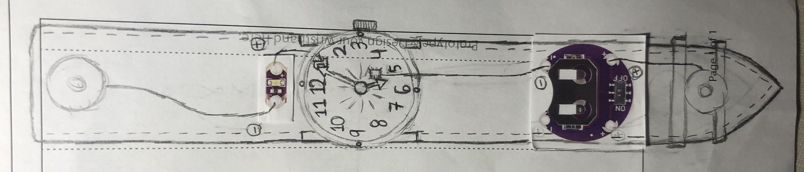
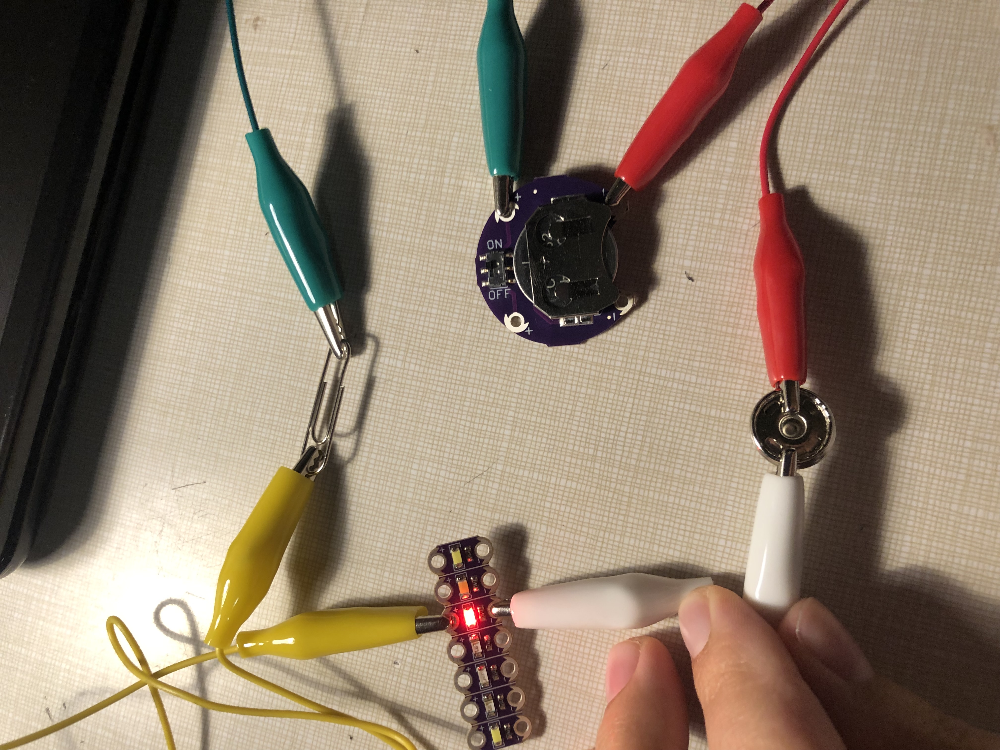
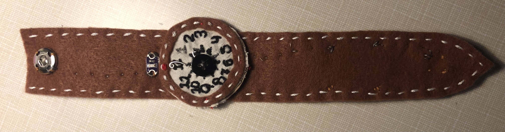
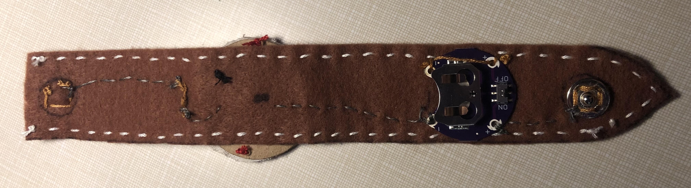

Do you know how many evil plans fail because of the villain's poor timing? A trinket like this will serve me nicely, and it's about the right size to wrap around my tail. (who's hand is that?)
## Introducing... the wrist watch!

The wrist watch is composed of a brown band of fabric (mimicking leather) with a watch face in the middle that turns on a light when the snaps are connected and the hands are moved to the right position (5:05).

This project began by prototyping homemade switches on paper.

I spent a lot of time looking at old-school leather watches, and my initial design was a little ambitious, but I'm happy with how it ultimately turned out. I knew from the prototyping phase that I wanted to make a break in the circuit between one of the numbers and a space before another number. This way, the short hand can't activate the patch intended for the long hand. The hands themselves would be conductive and bridge the gap. 

Onto the alligator-ing phase, which Ursa forgot about last time. Her pay will be adequately docked.

This phase connected the different parts of my watch: battery holder, light, metal snap, and paperclip. I used the paper clip as the watch's hands since they were conductive. The alligator phase was helpful in identifying how each part should connect.

### Behold! The front and back of my finished product!

As for the other details: the edges of the plush are sealed with a whip stitch, the eyes and inside of the bowtie were made using a satin stitch, the shape of the mouth was formed with a back stitch, and the other components like the snout fabric and ears pieces were connected with running stitches. And the button is made of good ol' cardboard and black duct tape that I stabbed holes into. Also, the whole thing is stuffed with crumpled paper towels, courtesy of the local bathroom.

My tip to future undertakers of this project is to make good use of needle threaders, not for threading needles (I never used them for that), but for tying finishing knots! Often, I would come to the end of my fabric and lack enough space to get my needle through a loop. Fortunately, with enough finessing, needle threaders can tie that knot! They're also good for tying knots in hard-to-reach places, like the inside of a whip stitch.
